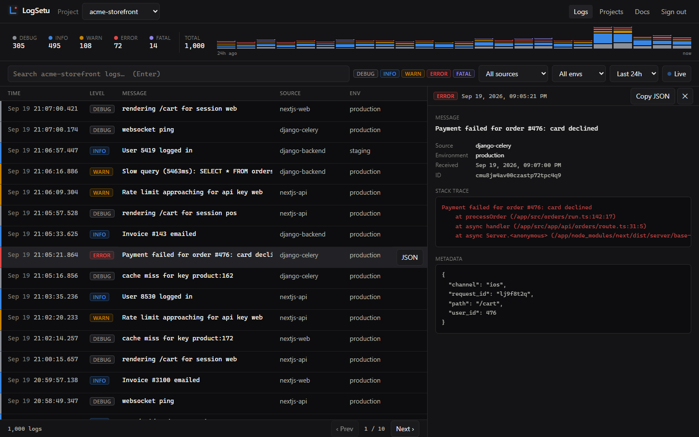
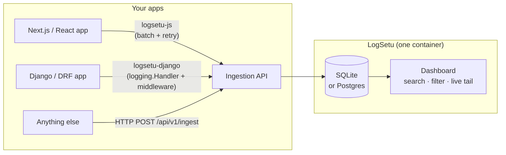

<p align="center">
  
</p>

<h1 align="center">LogSetu</h1>

<p align="center">
  Free, open-source, self-hosted log management for <b>Next.js / React</b> and <b>Django</b>.<br/>
  One <code>docker compose up</code>, two 5-minute SDKs, one dashboard for all your apps.
</p>

<p align="center">
  <a href="LICENSE"></a>
  <a href="https://github.com/itsrajverma/logsetu/actions/workflows/ci.yml"></a>
  <a href="https://www.npmjs.com/package/logsetu-js"></a>
  <a href="https://pypi.org/project/logsetu-django/"></a>
  <a href="https://github.com/itsrajverma/logsetu/pkgs/container/logsetu"></a>
</p>

<p align="center">
  
</p>

---

**LogSetu** ("setu" = *bridge* in Sanskrit) is a lightweight alternative to Sentry / Logtail / Datadog for developers who
run a few products and just want to **see their logs in one place** — without a SaaS bill, a vendor
lock-in, or a 12-container Kubernetes deployment.

- **Self-hosted, single container.** SQLite by default; switch to Postgres with one env var.
- **Free forever.** MIT licensed, no paid tier, no telemetry, no account.
- **Multi-stack out of the box.** Official SDKs for Next.js/React (`logsetu-js`) and Django/DRF (`logsetu-django`); a plain HTTP API for everything else.
- **Multi-project from day one.** Run all your SaaS products under one dashboard with per-project API keys.

## 30-second quickstart

**1. Run the server**

```bash
curl -o docker-compose.yml https://raw.githubusercontent.com/itsrajverma/logsetu/main/docker-compose.yml
LOGSETU_ADMIN_PASSWORD=change-me docker compose up -d
# → open http://localhost:8686, sign in, create a project, copy its API key
```

**2. Next.js / React**

```bash
npm install logsetu-js
```

```ts
import { LogSetu } from "logsetu-js";

const logger = LogSetu.init({
  apiKey: process.env.NEXT_PUBLIC_LOGSETU_API_KEY,
  endpoint: "http://localhost:8686",
  environment: "production",
  source: "nextjs-web",
});

logger.info("User logged in", { userId: 123 });
logger.error("Payment failed", { error: err, orderId: 456 });
```

**3. Django**

```bash
pip install logsetu-django
```

```python
# settings.py
LOGGING = {
    "version": 1,
    "handlers": {
        "logsetu": {
            "class": "logsetu.handler.LogSetuHandler",
            "api_key": env("LOGSETU_API_KEY"),
            "endpoint": "http://localhost:8686",
            "environment": "production",
            "source": "django-backend",
            "level": "WARNING",
        },
    },
    "root": {"handlers": ["logsetu"], "level": "INFO"},
}
MIDDLEWARE = [..., "logsetu.middleware.LogSetuMiddleware"]  # auto-captures 500s with request context
```

That's it — logs show up in the dashboard in real time.

## Features

- ✅ **Ingestion API** — `POST /api/v1/ingest`, single or batched, Bearer-key auth, validated with zod, per-project rate limiting, responds `202` before writing
- ✅ **Live dashboard** — auto-refreshing log table, color-coded levels, dark mode, keyboard-friendly
- ✅ **Search & filter** — free-text search, level, source, environment, time range (presets or custom), all in the URL so views are shareable
- ✅ **Detail panel** — full message, stack trace, metadata JSON, one-click "filter by this source/env", copy-as-JSON
- ✅ **24h overview** — counts by level and an hourly activity chart per project
- ✅ **Multi-project** — separate API keys, rotate keys, ready-to-paste integration snippets per project
- ✅ **`logsetu-js`** — ~2.5 KB gzipped, batching + retry, `captureException`, `<LogSetuErrorBoundary>`, Next.js `instrumentation.ts` hooks, browser + Node + Edge, fully typed
- ✅ **`logsetu-django`** — a `logging.Handler` (zero deps, background thread), middleware that captures unhandled exceptions with redacted headers, tenant tagging for multi-tenant SaaS
- ✅ **Retention policies** — keep logs for N days per project (or a server-wide default); old logs are purged automatically every hour
- ✅ **SQLite or Postgres** — zero-config SQLite on a Docker volume, or set `DATABASE_URL=postgresql://…`
- ✅ **Single admin password** — no user-management ceremony for v1

## Architecture



Everything lives in `apps/server`, a single Next.js app that serves both the API and the dashboard.

## LogSetu vs. the alternatives

| | **LogSetu** | Sentry (self-hosted) | Grafana Loki | Logtail / Datadog / Sentry SaaS |
|---|---|---|---|---|
| Free | ✅ MIT, forever | ✅ | ✅ | ❌ usage-based |
| Self-hosted | ✅ 1 container | ✅ ~15 containers, 16 GB RAM | ✅ + Promtail + Grafana | ❌ |
| Setup time | 2 minutes | an afternoon | an afternoon | 10 minutes + credit card |
| Next.js/React SDK | ✅ official, 2.5 KB | ✅ (~30 KB+) | ❌ (bring your own) | ✅ |
| Django SDK | ✅ official, zero deps | ✅ | ❌ | ✅ |
| Multi-project dashboard | ✅ | ✅ | ✅ (LogQL) | ✅ |
| Structured metadata + stack traces | ✅ | ✅ | ✅ | ✅ |
| Error grouping / issue workflow | ❌ (planned) | ✅ | ❌ | ✅ |
| Alerting | 🚧 planned | ✅ | ✅ | ✅ |

LogSetu is deliberately *not* trying to be Sentry. If you need release health, performance tracing and an issue triage
workflow, use Sentry. If you want to **see what your apps are doing** across a handful of products with something you
can run on a $5 VPS, LogSetu is for you.

## Self-hosting

```bash
# SQLite (default) — data lives in the `logsetu-data` Docker volume
docker compose up -d

# Postgres — copy .env.example → .env, set LOGSETU_ADMIN_PASSWORD, LOGSETU_SECRET, POSTGRES_PASSWORD
docker compose -f docker-compose.prod.yml up -d
```

| Env var | Default | Description |
|---|---|---|
| `LOGSETU_ADMIN_PASSWORD` | — (required) | Dashboard password |
| `LOGSETU_SECRET` | derived from password | Signs session cookies; set a random string in production |
| `LOGSETU_PORT` | `8686` | Host port |
| `DATABASE_URL` | `file:/data/logsetu.db` | `file:…` for SQLite or `postgresql://…` |
| `LOGSETU_RATE_LIMIT_PER_MIN` | `1000` | Max logs per project per minute |
| `LOGSETU_DEFAULT_RETENTION_DAYS` | unset (keep forever) | Default retention for projects without their own setting |
| `LOGSETU_SECURE_COOKIES` | `0` | Set `1` behind HTTPS |

Schema migrations run automatically on start. See [docs/self-hosting.md](docs/self-hosting.md) for reverse proxies,
backups, upgrades and building the image yourself.

## HTTP API

Any language can send logs with one request:

```bash
curl -X POST http://localhost:8686/api/v1/ingest \
  -H "Authorization: Bearer ls_your_api_key" \
  -H "Content-Type: application/json" \
  -d '{"level":"error","message":"Payment failed","source":"go-worker","meta":{"orderId":456}}'
```

Full reference (ingest, query, projects, stats): [docs/http-api.md](docs/http-api.md).

## Roadmap

- [ ] **Alerting** — Slack / email / webhook when `error` or `fatal` logs exceed a threshold
- [x] **Log retention policies** — auto-delete logs older than N days per project
- [ ] **SSE real-time streaming** — push instead of polling in the dashboard
- [ ] **Error grouping** — collapse identical stack traces into issues with counts
- [ ] **OpenTelemetry export** — forward logs to any OTLP collector
- [ ] **Grafana integration** — data source plugin / Loki-compatible query endpoint
- [ ] **More SDKs** — FastAPI / Flask, Express / Hono, Go
- [ ] **Multi-user auth** — teams, read-only users, SSO

Have a use case? [Open an issue](https://github.com/itsrajverma/logsetu/issues) — the roadmap is driven by what people actually need.

## Repository layout

```
logsetu/
├── apps/server/              # Next.js: ingestion API + dashboard (Prisma, SQLite/Postgres)
├── packages/logsetu-js/      # npm SDK (Next.js, React, Node)
├── packages/logsetu-django/  # PyPI SDK (Django, DRF)
├── examples/nextjs-app/      # throwaway app used to test logsetu-js end-to-end
├── examples/django-app/      # throwaway app used to test logsetu-django end-to-end
├── docs/                     # self-hosting, HTTP API, configuration
├── docker-compose.yml        # one-command self-host (SQLite)
├── docker-compose.prod.yml   # Postgres variant
└── Dockerfile
```

## Contributing

PRs and issues are very welcome. Read [CONTRIBUTING.md](CONTRIBUTING.md) for the dev setup (it's `pnpm install && pnpm dev`)
and our [Code of Conduct](CODE_OF_CONDUCT.md).

## License

[MIT](LICENSE) © Raj Verma
